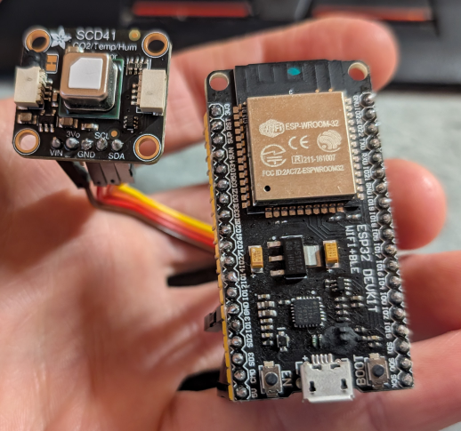
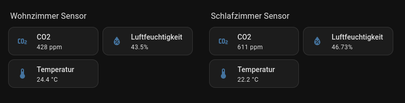
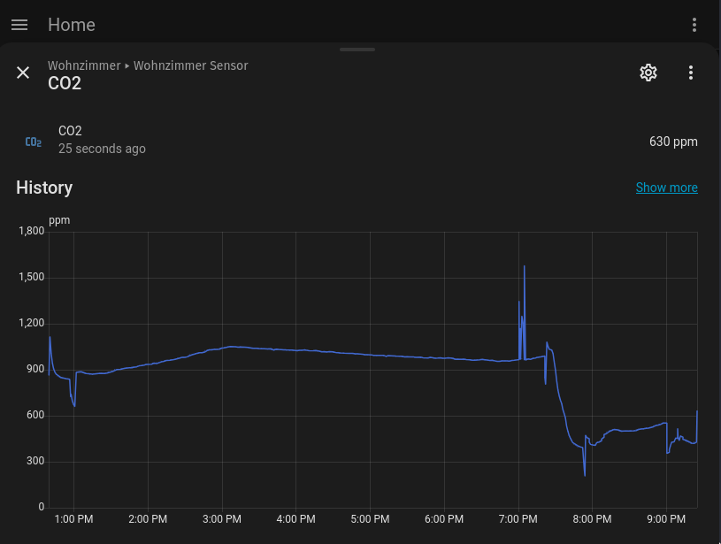
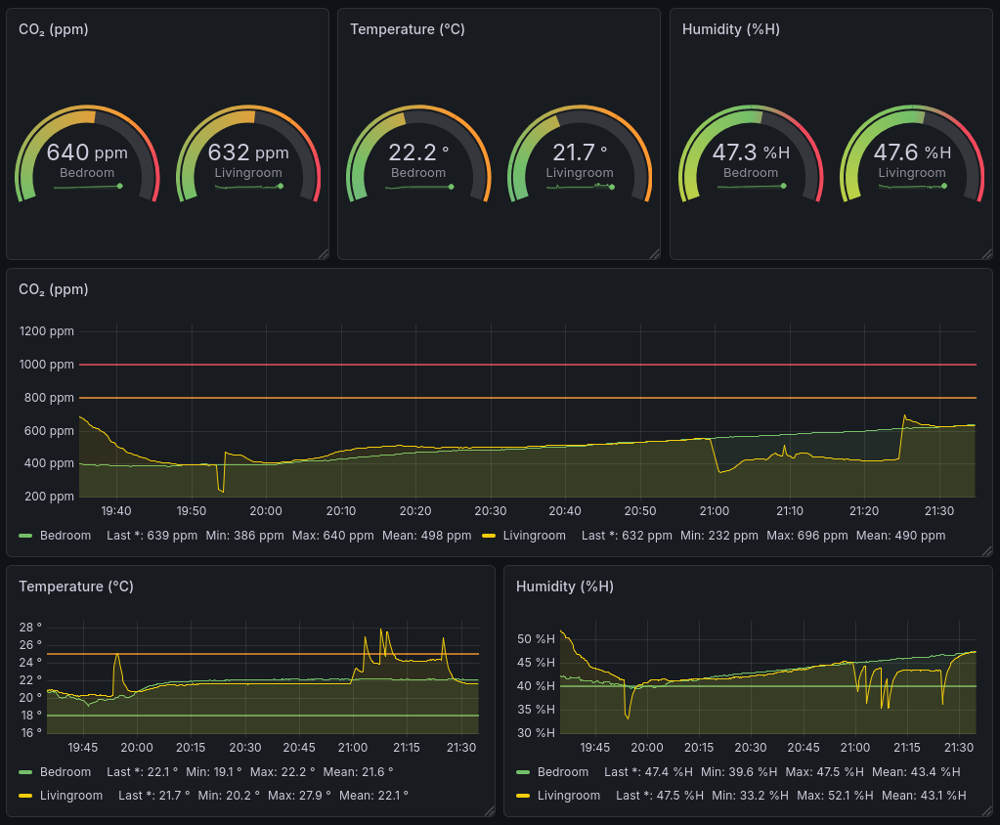

# ESP32 CO₂ SCD-41 Sensor

## Hardware

- Microcontroller: ESP32
- CO₂ Sensor: [Sensirion SCD-41](https://sensirion.com/products/catalog/SCD41)

Hardware:



## Features

- Provide Prometheus metrics endpoint to visualize it in Grafana
- Send values to MQTT topic (e.g. Mosquitto, integrated in Home Assistant)
- Send MQTT Auto Discovery messages to automatically configure Home Assistant

Home Assistant:





Grafana Dashboard:



## Description

See blog post for more details: https://emanuelduss.ch/posts/co2-measurement/.

## Usage / Build

Configure settings in `settings.h`.

### VS Code

- Open project in VS code.
- Install PlatformIO extension.
- Upload to ESP (Ctrl+Alt+U)
- Verify output in serial console

### PlatformIO

First, install PlatformIO. Then build and upload to ESP:

```bash
pio run --target upload
```

Verify output from serial device:

```bash
sudo stty -F /dev/ttyUSB0 115200
cat /dev/ttyUSB0 
```

## Security Note

Note: Everything is transmitted in cleartext. MQTT credentials and measurement values will be transmitted in cleartext.

## Acknowledgement

- @sighmon's general idea and code for TaskScheduler: https://github.com/sighmon/co2_sensor_scd4x_esp32_http_server
- Sensirion SDC4x Library and Example Code: https://github.com/Sensirion/arduino-i2c-scd4x